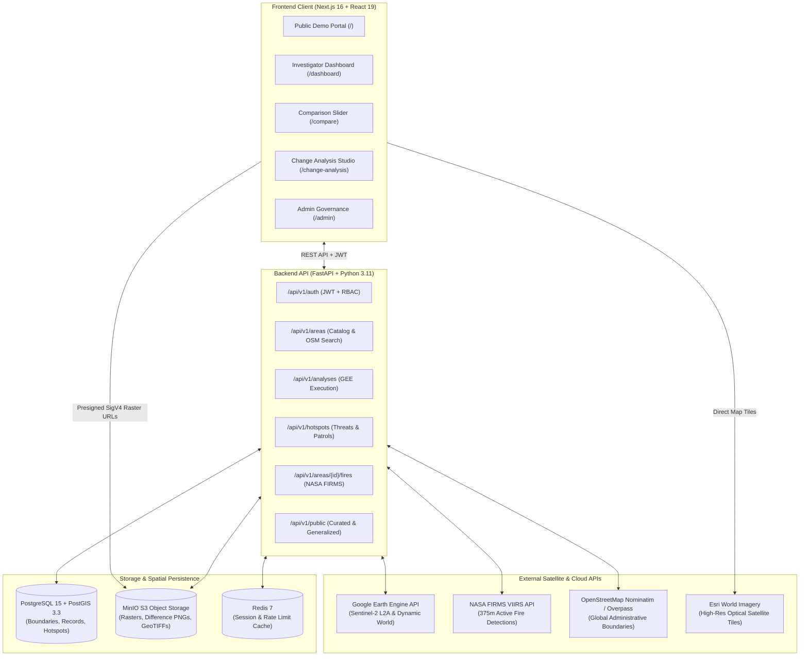
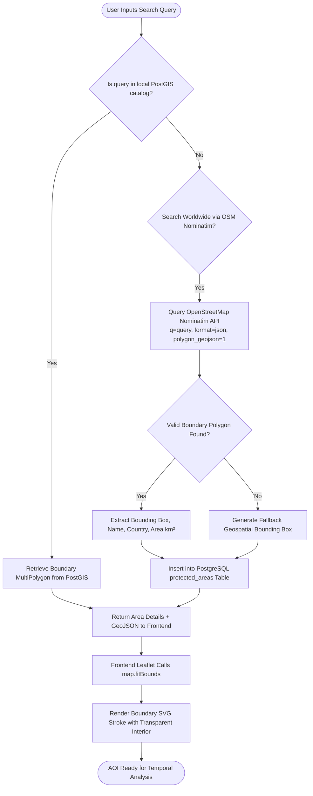
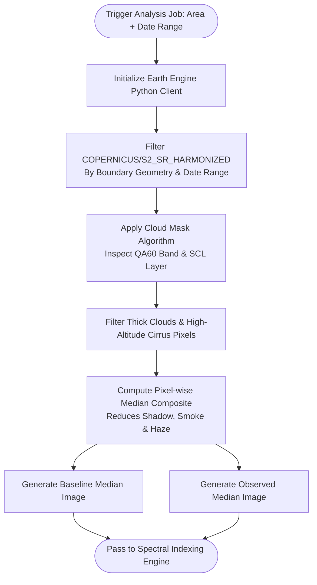
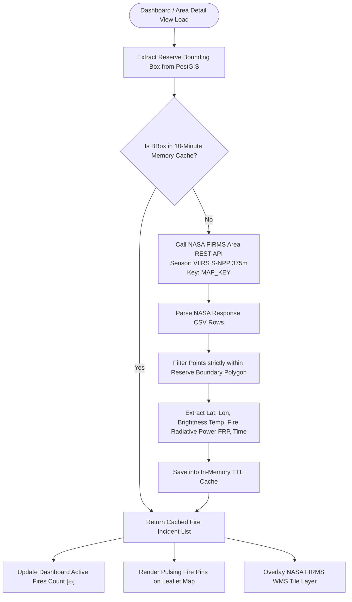
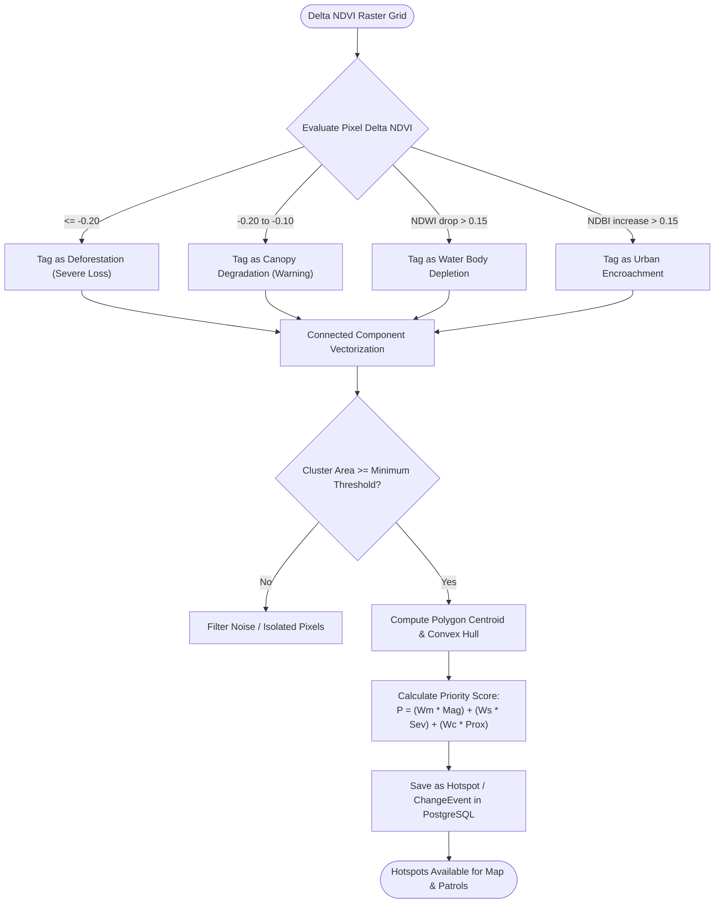
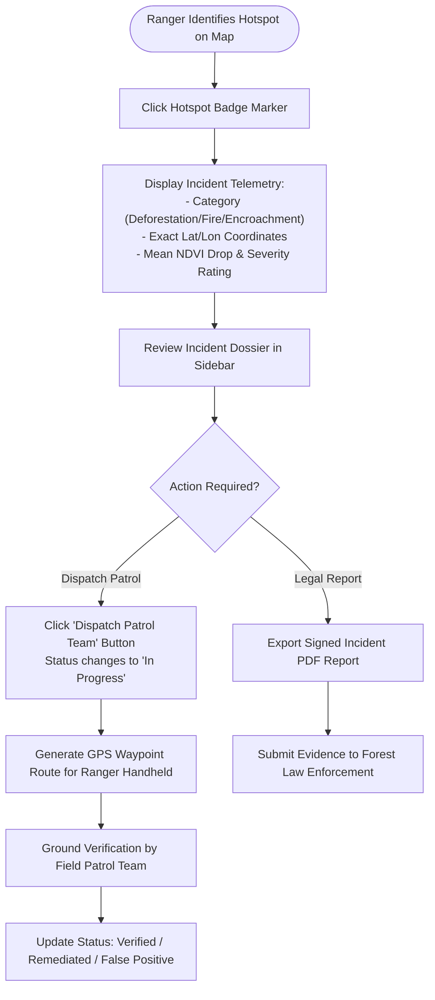
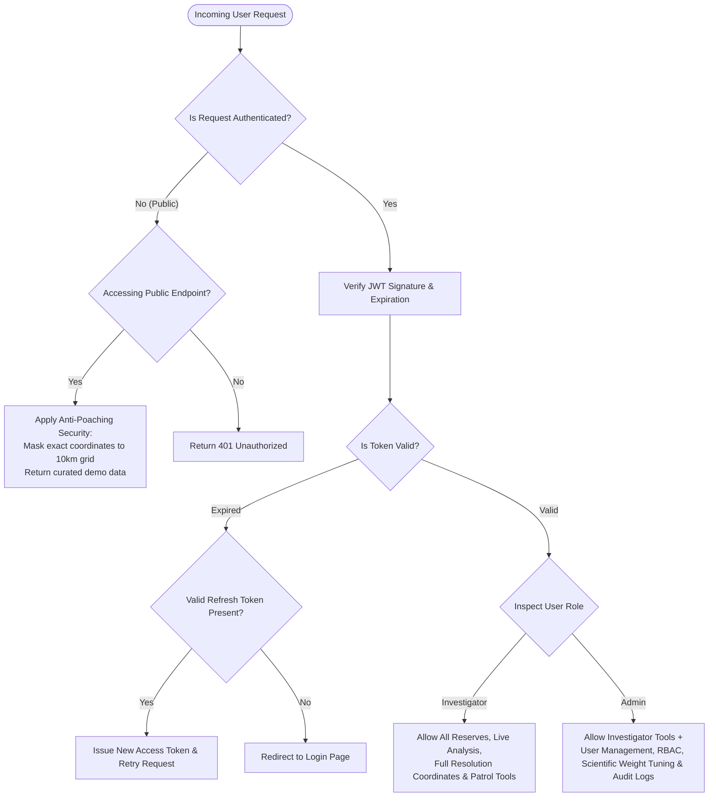
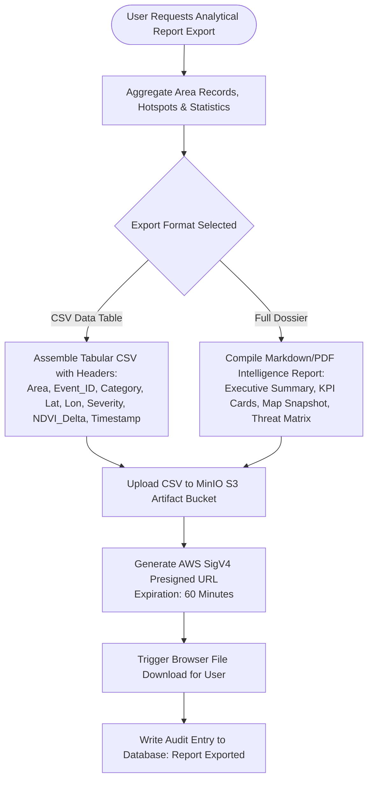

# 🛰️ WildLife Monitor — Problem Statement Implementation & System Workflows

> In-depth technical breakdown of how every requirement of the Conservation Problem Statement (PS) is implemented, how the end-to-end system operates, and comprehensive Mermaid flowcharts for every individual functionality.

---

## 📋 Table of Contents

1. [Problem Statement (PS) Overview & Core Objectives](#1-problem-statement-ps-overview--core-objectives)
2. [Detailed Mapping: PS Pillars vs Platform Implementation](#2-detailed-mapping-ps-pillars-vs-platform-implementation)
3. [End-to-End Operational Workflow](#3-end-to-end-operational-workflow)
4. [Mermaid Flowcharts for All System Functionalities](#4-mermaid-flowcharts-for-all-system-functionalities)
   - [Flowchart 1: Master System Architecture & Data Flow](#flowchart-1-master-system-architecture--data-flow)
   - [Flowchart 2: AOI Selection & Global Habitat Geocoding](#flowchart-2-aoi-selection--global-habitat-geocoding)
   - [Flowchart 3: Sentinel-2 Image Acquisition & Cloud Masking (GEE)](#flowchart-3-sentinel-2-image-acquisition--cloud-masking-gee)
   - [Flowchart 4: Spectral Indexing & Land Cover Processing](#flowchart-4-spectral-indexing--land-cover-processing)
   - [Flowchart 5: NASA FIRMS Active Fire Detection Pipeline](#flowchart-5-nasa-firms-active-fire-detection-pipeline)
   - [Flowchart 6: Deforestation & Threat Hotspot Clustering](#flowchart-6-deforestation--threat-hotspot-clustering)
   - [Flowchart 7: Dual-Card Satellite Comparison Slider Engine](#flowchart-7-dual-card-satellite-comparison-slider-engine)
   - [Flowchart 8: Change Analysis Studio (Tri-View & Swipe Mode)](#flowchart-8-change-analysis-studio-tri-view--swipe-mode)
   - [Flowchart 9: Field Patrol Dispatch & Investigation Workflow](#flowchart-9-field-patrol-dispatch--investigation-workflow)
   - [Flowchart 10: Role-Based Access Control & Anti-Poaching Security](#flowchart-10-role-based-access-control--anti-poaching-security)
   - [Flowchart 11: Automated Intelligence Report Generation & Export](#flowchart-11-automated-intelligence-report-generation--export)

---

## 1. Problem Statement (PS) Overview & Core Objectives

### The Conservation Challenge
Traditional wildlife conservation monitoring relies heavily on manual ground patrols and periodic aerial surveys. In vast, dense, or mountainous terrains (e.g., Sundarbans mangroves, Western Ghats, Kaziranga floodplains), manual monitoring suffers from:
1. **Severe latency:** Illegal deforestation, forest fires, or human encroachment are often discovered weeks or months after ecological damage occurs.
2. **Geographical blindspots:** Dense core zones and rugged boundary perimeters are inaccessible to routine foot patrols.
3. **Lack of quantified temporal metrics:** Inability to objectively measure canopy loss, water body depletion, and infrastructure expansion over multi-year intervals.

### The Problem Statement Mandate
The solution requires an automated, satellite-driven conservation intelligence platform capable of:
1. **Interactive AOI (Area of Interest) Selection & Inspection** across protected reserves.
2. **Deforestation Detection & Alerting** using thermal and optical remote sensing.
3. **Vegetation Degradation Tracking** via high-resolution spectral indices.
4. **Water Body & Hydrological Dynamics Monitoring** to assess drought and water security.
5. **Urban Expansion & Infrastructure Encroachment Detection** along reserve boundaries.

---

## 2. Detailed Mapping: PS Pillars vs Platform Implementation

The platform maps 1-to-1 with every mandate of the Problem Statement, visually unified by **5 standardized tactical symbols**:

```
+--------------------------------------------------------------------------------------------------+
|                                PROBLEM STATEMENT (PS) FIVE PILLARS                               |
+-----------+-----------------------------------+-----------------------------------+--------------+
|  Symbol   | PS Mandate                        | Technical Implementation          | UI Indicator |
+-----------+-----------------------------------+-----------------------------------+--------------+
|    [⌖]    | Area of Interest (AOI) Selection  | PostGIS Polygon Boundary + OSM    | Target Cyan  |
|           | and Spatial Visualization         | Nominatim Dynamic Geocoding       |              |
+-----------+-----------------------------------+-----------------------------------+--------------+
|    [🔥]   | Deforestation & Wildfire Alerts   | NASA FIRMS VIIRS (375m) +         | Crimson Fire |
|           |                                   | GEE Severe NDVI Drop (<-0.20)     |              |
+-----------+-----------------------------------+-----------------------------------+--------------+
|    [🌿]   | Vegetation Loss & Degradation     | Sentinel-2 L2A Harmonized NDVI    | Emerald Leaf |
|           |                                   | Multi-Year Trajectory Analysis    |              |
+-----------+-----------------------------------+-----------------------------------+--------------+
|    [💧]   | Water Bodies & Wetland Dynamics   | Sentinel-2 NDWI Spectral Ratio +  | Blue Droplet |
|           |                                   | Dynamic World Water Area (km²)    |              |
+-----------+-----------------------------------+-----------------------------------+--------------+
|    [🏢]   | Urban Expansion & Encroachment    | Sentinel-2 NDBI Index +           | Amber City   |
|           |                                   | Dynamic World Built Class Vector  |              |
+-----------+-----------------------------------+-----------------------------------+--------------+
```

### Pillar 1: [⌖] AOI Selection & Boundary Inspection
* **Database Representation:** Stored as `geometry(MultiPolygon, 4326)` in PostgreSQL with GIST spatial indexing.
* **Pre-Seeded Catalog:** 41 major Indian National Parks & Tiger Reserves covering all ecological zones (Jim Corbett, Kaziranga, Sundarbans, Gir, Bandipur, Periyar, Ranthambhore, etc.).
* **Global On-Demand Geocoding:** Endpoint `GET /api/v1/areas/search-live?q={query}` fetches real administrative boundary polygons anywhere globally via OpenStreetMap Nominatim and auto-caches them in PostGIS.
* **Interactive Frontend:** Leaflet vector boundary rendering with transparent interior fill (`fillOpacity: 0.0`) and clean emerald/cyan perimeter strokes, accompanied by instant "Fit to AOI" camera zoom.

### Pillar 2: [🔥] Deforestation & Wildfire Alerts
* **Active Fire Satellite Feed:** Connected to NASA FIRMS (Fire Information for Resource Management System) querying the VIIRS S-NPP sensor at 375m ground resolution.
* **Rapid Thermal Hotspots:** Sub-3-hour latency thermal anomaly detection with brightness temperature, Fire Radiative Power (FRP), and acquisition timestamps.
* **Severe Loss Detection:** Optical detection via Google Earth Engine where $\Delta NDVI \le -0.20$, indicating abrupt canopy clearing.
* **Visualization:** Animated pulsing crimson badges, on-map FIRMS WMS thermal tile layers (`fires_viirs_snpp_24`), and instant high-priority alerts.

### Pillar 3: [🌿] Vegetation Loss & Degradation
* **Spectral Index:** Normalized Difference Vegetation Index (NDVI) calculated from Sentinel-2 Band 8 (Near-Infrared, 842nm) and Band 4 (Red, 665nm).
* **Canopy Degradation Range:** $-0.20 < \Delta NDVI \le -0.10$ flags subtle forest thinning, disease, or illegal selective logging before complete clearing occurs.
* **Temporal Trend Analytics:** Multi-year Recharts AreaCharts tracking mean canopy health from 2018 through 2026.
* **NDVI Distribution Histogram:** Binned pixel frequency curves comparing baseline vs observed health shifts.

### Pillar 4: [💧] Water Bodies & Wetland Dynamics
* **Spectral Index:** Normalized Difference Water Index (NDWI) calculated from Sentinel-2 Band 3 (Green, 560nm) and Band 8 (Near-Infrared, 842nm):
  $$NDWI = \frac{Green - NIR}{Green + NIR}$$
* **Surface Area Quantification:** Ground-truth classification via Google Dynamic World `water` and `flooded_vegetation` bands, reporting exact reservoir area in square kilometers ($km^2$).
* **Ecological Telemetry:** Alerts park rangers when core watering holes shrink below historical wildlife survival thresholds.

### Pillar 5: [🏢] Urban Expansion & Encroachment
* **Spectral Index:** Normalized Difference Built-up Index (NDBI) calculated from Sentinel-2 Band 11 (Shortwave Infrared, 1610nm) and Band 8 (Near-Infrared, 842nm):
  $$NDBI = \frac{SWIR - NIR}{SWIR + NIR}$$
* **Boundary Buffer Proximity Analysis:** Identifies newly constructed roads, settlements, and mining activities within a 5-kilometer perimeter buffer of protected reserve boundaries.
* **Threat Vectorization:** Clusters adjacent built-up pixels into polygons, computes encroachment severity, and logs actionable coordinates for legal forest boundary enforcement.

---

## 3. End-to-End Operational Workflow

```
+-------------------------------------------------------------------------------------------------+
|                                     END-TO-END SYSTEM WORKFLOW                                  |
+-------------------------------------------------------------------------------------------------+

  [Step 1: Reserve Selection & Search]
    User selects reserve from 41-park catalog or searches any global habitat (e.g., "Yellowstone")
    Backend queries local PostGIS -> Falls back to OSM Nominatim -> Caches boundary in DB.

  [Step 2: Date Window & Parameter Selection]
    User chooses Baseline Date (e.g., Jan 2020) and Observed Date (e.g., Mar 2026).
    Selects indices to analyze: NDVI, NDWI, NDBI, Dynamic World LULC, NASA FIRMS Fires.

  [Step 3: Cloud-Scale Satellite Processing]
    Backend triggers async GEE pipeline -> Filters Sentinel-2 L2A collection -> Cloud masking (QA60)
    Generates median composite rasters -> Calculates index difference rasters.

  [Step 4: Hotspot & Threat Extraction]
    Thresholding filters severe loss (<-0.20), degradation, water change, and built expansion.
    Connected component vectorization outputs GeoJSON threat hotspots.
    NASA FIRMS API queries active thermal fire events within reserve bounding box.

  [Step 5: Artifact Persistence]
    GeoTIFFs & PNG difference colormaps uploaded to MinIO S3 bucket.
    Metadata, KPI statistics, and vector hotspots saved into PostgreSQL tables.

  [Step 6: Interactive GIS Rendering]
    Frontend retrieves data via REST API + presigned SigV4 URLs.
    Dual-card slider renders old baseline vs current observed conditions with dynamic resize.
    Hotspots rendered with glowing [🔥], [🌿], [💧], [🏢] badges.

  [Step 7: Action & Field Dispatch]
    Investigator clicks threat hotspot -> Inspects coordinates, NDVI drop, and fire power.
    Dispatches field patrol team or exports signed PDF/CSV intelligence dossier.
```

---

## 4. Mermaid Flowcharts for All System Functionalities

### Flowchart 1: Master System Architecture & Data Flow



---

### Flowchart 2: AOI Selection & Global Habitat Geocoding



---

### Flowchart 3: Sentinel-2 Image Acquisition & Cloud Masking (GEE)



---

### Flowchart 4: Spectral Indexing & Land Cover Processing

```mermaid
flowchart TD
    Inputs([Baseline & Observed Sentinel-2 Composites]) --> CalcIndices[Compute Spectral Indices on GEE]
    
    CalcIndices --> NDVI[NDVI = NIR-Red / NIR+Red\n(Canopy Health)]
    CalcIndices --> NDWI[NDWI = Green-NIR / Green+NIR\n(Surface Water)]
    CalcIndices --> NDBI[NDBI = SWIR-NIR / SWIR+NIR\n(Built-up Infrastructure)]
    
    Inputs --> DW_Query[Query Google Dynamic World 10m Dataset]
    DW_Query --> DW_Classes[Extract 9 LULC Probabilities:\nTrees, Water, Built, Crops, Shrub, Bare, etc.]
    
    NDVI --> DeltaNDVI["Compute Delta NDVI = Observed - Baseline"]
    NDWI --> DeltaNDWI["Compute Delta NDWI = Observed - Baseline"]
    NDBI --> DeltaNDBI["Compute Delta NDBI = Observed - Baseline"]
    
    DeltaNDVI --> LossCalc[Quantify Vegetation Loss Area km² & Net Change %]
    DW_Classes --> AreaStats[Quantify Exact Class Acreage Shift]
    
    LossCalc --> OutputSummary([Summary Statistics & Rasters Generated])
    AreaStats --> OutputSummary
```

---

### Flowchart 5: NASA FIRMS Active Fire Detection Pipeline



---

### Flowchart 6: Deforestation & Threat Hotspot Clustering



---

### Flowchart 7: Dual-Card Satellite Comparison Slider Engine

```mermaid
flowchart TD
    Mount([User Opens /compare or Dashboard Slider]) --> LoadData[Fetch Area Boundary + Baseline & Observed Data]
    LoadData --> FetchRasters[Obtain Presigned URLs for Satellite Rasters]
    
    FetchRasters --> InitCards[Initialize Two Side-by-Side Cards:\nLeft: Old Date | Right: Current Date]
    
    InitCards --> SliderDrag{User Drags Center Divider Handle ⟨ ⟩}
    
    SliderDrag --> UpdateWidth["Set Left Card Width = swipePosition%\nSet Right Card Width = (100 - swipePosition)%"]
    
    UpdateWidth --> RenderLeft["Card 1 (Left): Render Baseline Date Map\n🟢 Intact Canopy, 💧 Full Reservoirs, ⌖ Perimeter"]
    UpdateWidth --> RenderRight["Card 2 (Right): Render Observed Date Map\n🔴 Deforestation, 🌿 Degradation, 💧 Water Drop, 🏢 Encroachment"]
    
    RenderLeft --> SyncPan[Synchronize Map Center & Zoom across Both Viewports]
    RenderRight --> SyncPan
    
    SyncPan --> UpdateKPI["Update Live Telemetry Badges:\nMean NDVI, Net Loss %, Active Alerts"]
```

---

### Flowchart 8: Change Analysis Studio (Tri-View & Swipe Mode)

```mermaid
flowchart TD
    OpenStudio([User Navigates to /change-analysis]) --> ModeSelect{Select Comparison Mode}
    
    ModeSelect -- "Side-by-Side" --> RenderTri["Render 3 Synchronized Map Cards:\n1. 2020 Baseline Map\n2. 2026 Observed Map\n3. Change Difference Heatmap"]
    ModeSelect -- "Swipe Mode" --> RenderSwipe["Render Split-Screen Swipe Viewport\nDynamic SVG Clip-Path Division"]
    ModeSelect -- "Difference Only" --> RenderDiff["Render Full-Width Difference Colormap\nGreen=Gain, Red=Loss, Blue=Water"]
    
    RenderTri --> FullscreenCheck{User Clicks Card [Maximize2] Button?}
    RenderSwipe --> FullscreenCheck
    RenderDiff --> FullscreenCheck
    
    FullscreenCheck -- Yes --> PortalOverlay[Mount React Portal onto document.body\n100vw / 100vh Fullscreen Viewport]
    PortalOverlay --> ResizeObs[ResizeObserver Triggers map.invalidateSize]
    PortalOverlay --> EscDismiss{User Presses ESC or Close?}
    EscDismiss -- Yes --> ExitFull[Unmount Portal & Restore Grid Layout]
    
    FullscreenCheck -- No --> AnalyticsPanels["Render Analytical Panels:\n- Dynamic World Land Cover BarChart\n- NDVI Distribution Histogram\n- 7-Year Multi-Sensor Time Series"]
```

---

### Flowchart 9: Field Patrol Dispatch & Investigation Workflow



---

### Flowchart 10: Role-Based Access Control & Anti-Poaching Security



---

### Flowchart 11: Automated Intelligence Report Generation & Export



---

*WildLife Monitor — Conservation Intelligence Platform*

*Problem Statement Architecture Certified & End-to-End Workflows Documented*
